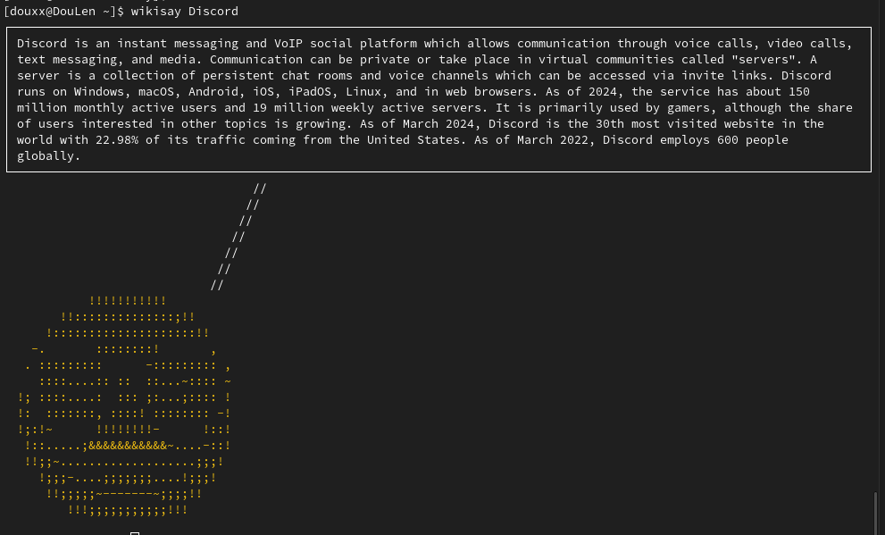

<a id="readme-top"></a>

<div align="center">



# Wikisay
A cowsay like cli command, but it returns a wiki answer

</div>

### Built with
* [![Nodejs][Node.js]][Node-url]


### Prerequisites

* npm
  ```sh
  npm install npm@latest -g
  ```


## Installation

Install Wikisay with
```sh
sudo npm install -g wikisay
```

## Usage
Run it with 
```sh
wikisay
```

<br>
<br>
<br>
<br>
<br>
<br>

<!-- LICENSE -->
## License

Distributed under the GPL-3.0 License. See `LICENSE.txt` for more information.

<p align="right">(<a href="#readme-top">back to top</a>)</p>


[Node.js]: https://img.shields.io/badge/node.js-43853D?style=for-the-badge&logo=nodedotjs&logoColor=white
[Node-url]: https://nodejs.org/
